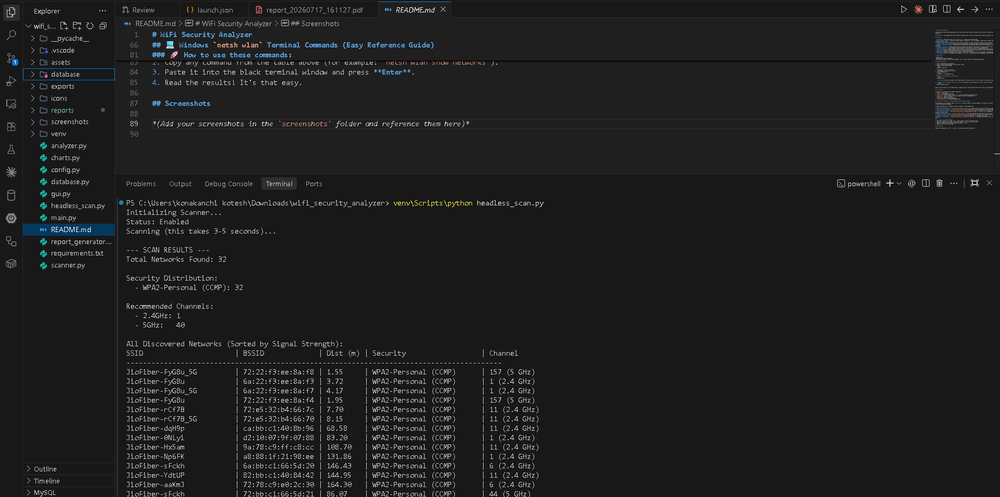
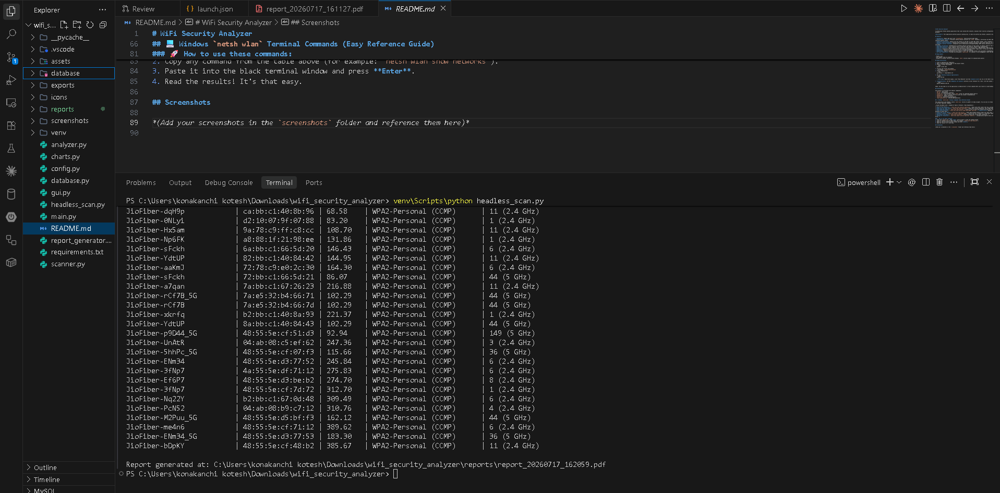
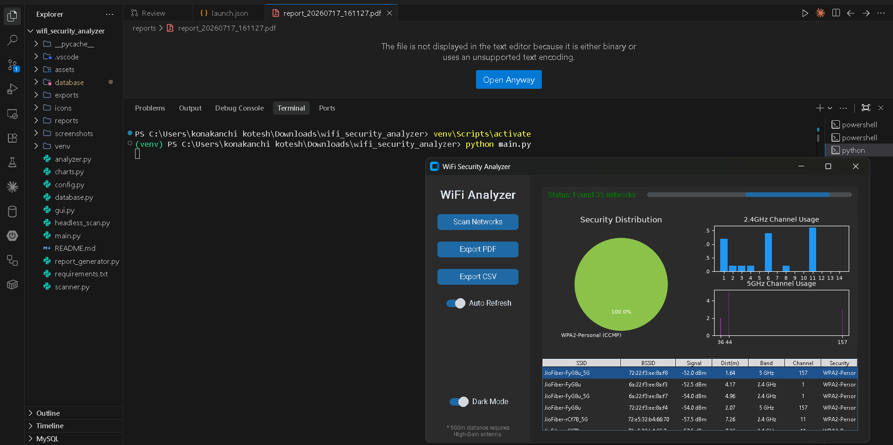
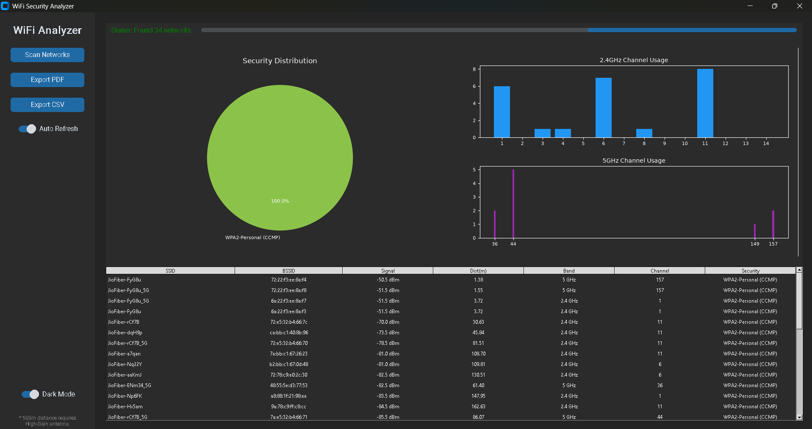
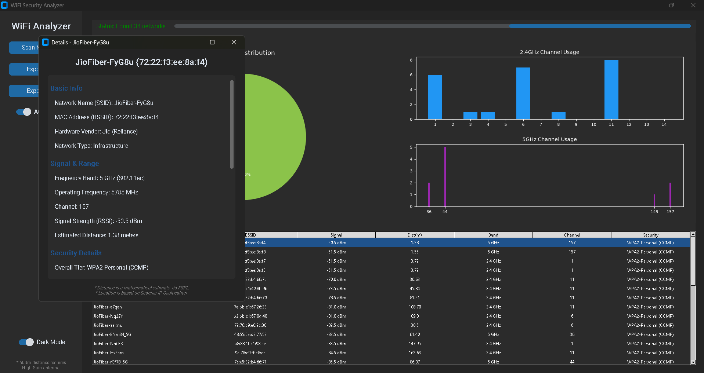

# WiFi Security Analyzer

A professional Python desktop application that scans nearby WiFi networks, analyzes their security configuration, and generates detailed security reports for educational and defensive purposes. 

**Disclaimer**: This application performs passive scanning only. It does not perform any attacks, password cracking, or unauthorized access.

## Features

- **Dashboard**: Modern GUI built with `CustomTkinter` featuring Dark/Light modes.
- **Advanced WiFi Scanner**: Discovers nearby networks natively via `netsh` (Windows), extracting raw SSID, BSSID, Signal Strength, Channel, Authentication, and Cipher types without arbitrary network limits.
- **Deep-Dive Inspection**: Double-click any network in the GUI to reveal MAC vendor lookups, exact frequency (MHz), security scores, and dual-band radio details.
- **Dynamic Threat Assessment**: Analyzes exact vulnerabilities uniquely tailored to each router based on its encryption tier, physical distance, signal strength, and operating band.
- **Advanced Location Tracking**: Integrates with IP Geolocation and OpenStreetMap (OSM) Reverse Geocoding to automatically resolve the scanner's exact District, Mandal/Suburb, City, and State.
- **Distance Estimation**: Mathematically estimates physical distance to each router (in meters) based on the Free-Space Path Loss (FSPL) formula.
- **Dual-Band Analysis**: Fully supports both 2.4 GHz and 5 GHz networks, mapping them independently.
- **Security Analyzer**: Highly granular classification of network security (e.g., WPA3-Personal, WPA2-Enterprise, CCMP vs TKIP).
- **Charts**: Visualizes security distribution and provides dual-band channel usage charts to help you find the least congested channels on both 2.4GHz and 5GHz.
- **Database**: Stores all scan histories locally in an SQLite database.
- **Reporting**: Exports comprehensive scan results to PDF, CSV, and JSON formats with actionable recommendations.
- **VS Code Integration**: Includes pre-configured `launch.json` for seamless 1-click debugging of both the GUI and Headless CLI scanner inside VS Code using the virtual environment.

## Requirements

- Python 3.12+
- WiFi Adapter (Must be enabled)
- Windows OS (Scanner natively parses Windows `netsh` utility output for advanced data points)

## Setup Instructions

1. Clone or download this repository.
2. Open a terminal/command prompt in the project folder.
3. Create a virtual environment:
   ```bash
   python -m venv venv
   ```
4. Activate the virtual environment:
   - On Windows: `venv\Scripts\activate`
5. Install dependencies:
   ```bash
   pip install -r requirements.txt
   ```
6. Run the **Desktop Graphical Application**:
   ```bash
   python main.py
   ```
   > **Pro Tip**: Once the UI opens, click "Scan Networks" and then **double-click** any row in the table to open the Deep-Dive Inspection popup (MAC Vendor, exact frequency, etc.).
   
7. **Alternatively**, run the **Headless CLI Scanner** directly in your terminal for a fast, rich text output (and automatic PDF generation):
   ```bash
   python headless_scan.py
   ```

*Note: You may need to run the application as Administrator to fetch complete WiFi scan results on some Windows setups.*

## Architecture

The project is structured into modular components:
- `main.py`: Entry point
- `gui.py`: CustomTkinter interface
- `scanner.py`: Custom Windows native `netsh` parser for advanced network metrics
- `analyzer.py`: Logic to assign security scores and channel recommendations
- `database.py`: SQLite operations
- `charts.py`: matplotlib visualizations
- `report_generator.py`: PDF/CSV/JSON generation

## 💻 Windows `netsh wlan` Terminal Commands (Easy Reference Guide)

This application uses Windows' native `netsh wlan` utility to gather its deep insights. You can also run these commands yourself directly in the terminal! Here is a crystal clear view of the most important commands:

| Action You Want To Do | Command to Type in Terminal | Easy Explanation |
| :--- | :--- | :--- |
| **See All WiFi Networks** | `netsh wlan show networks mode=bssid` | Shows every WiFi router near you, including their hidden MAC addresses, signal strength %, and exact channels. |
| **View Your PC's WiFi Info** | `netsh wlan show interfaces` | Shows your current connection, your IP/MAC address, and if your WiFi card supports 5GHz (802.11ac/ax). |
| **See Saved WiFi Names** | `netsh wlan show profiles` | Prints a list of every WiFi network you have ever connected to and saved on this PC. |
| **View Saved Password** | `netsh wlan show profile name="WIFI_NAME" key=clear` | **(Hack/Trick):** Replaces `WIFI_NAME` with a saved network. Scroll to "Key Content" to see the saved password in plain text! |
| **Check WiFi Driver Specs** | `netsh wlan show drivers` | Shows deep hardware details about your WiFi chip, like if it supports creating a Mobile Hotspot. |
| **Connect to WiFi** | `netsh wlan connect name="WIFI_NAME"` | Forces your PC to connect to a saved WiFi network instantly via the terminal. |
| **Disconnect from WiFi** | `netsh wlan disconnect` | Instantly drops your current WiFi connection. |
| **Backup All Passwords** | `netsh wlan export profile key=clear folder=C:\` | Automatically exports every saved WiFi profile and their passwords into XML files saved in your C:\ drive. |

### 🚀 How to use these commands:
1. Press the `Windows Key`, type **cmd**, and hit Enter to open the Command Prompt.
2. Copy any command from the table above (for example: `netsh wlan show networks`).
3. Paste it into the black terminal window and press **Enter**.
4. Read the results! It's that easy.

## screenshots

### Headless CLI Scanner Output



### Automated PDF Report Generation


### Interactive GUI Dashboard



### Deep-Dive Network Inspection


## 📜 License

This project is licensed under the MIT License.

*Built with ❤️ by  **Konakanchi Kotesh***